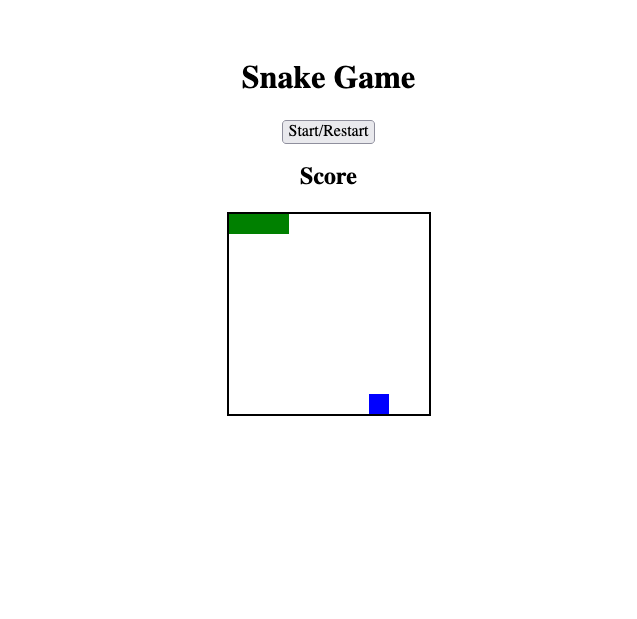
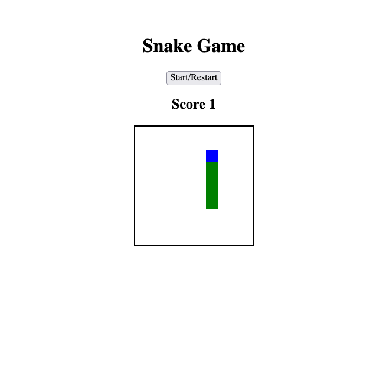
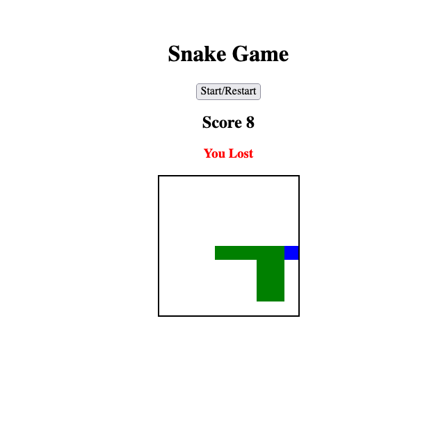
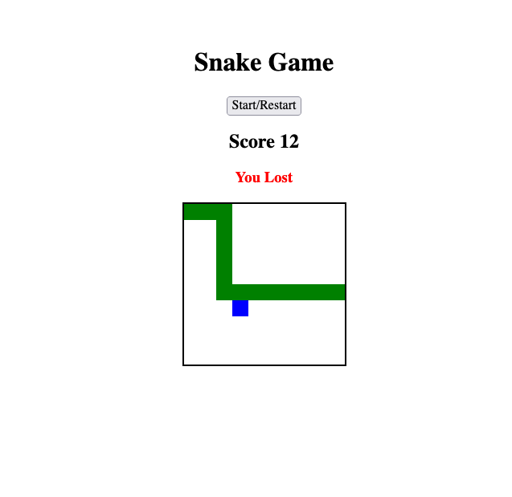
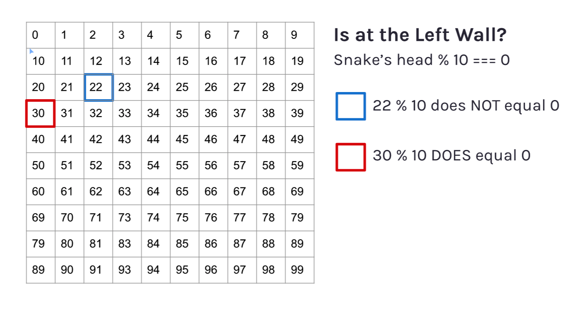

# Scrimba Frontend Career Path - (Snake Game - Module 04)

This is a solution to the [Scrimba Frontend Career Path - (Module 4/Snake Game)](https://scrimba.com/learn/frontend).

## Table of contents

- [Overview](#overview)
  - [The challenge](#the-challenge)
  - [Screenshot](#screenshot)
  - [Links](#links)
- [My process](#my-process)
  - [Built with](#built-with)
  - [What I learned](#what-i-learned)
  - [Continued development](#continued-development)
  - [Useful resources](#useful-resources)
- [Author](#author)
- [Acknowledgments](#acknowledgments)


## Overview

### The challenge

Make a Snake game (like the ones on Nokia Phones)

Users should be able to Code/Understand:

- addEventListener()
- querySelectorAll()
- querySelector()
- length
- forEach()
- clearInterval()
- push()
- classList.add()
- classList.remove()
- keyCode
- classList.contains()
- innerText
- setTimeout()
- textContent
- unshift()
- pop()
- setInterval()
- Math.floor()
- Math.random()

### Screenshot








### Links

- Solution Github URL: [https://github.com/Rod-Barbosa/snake-game](https://github.com/Rod-Barbosa/snake-game)
- Live Site URL: [https://snake-game-wheat.vercel.app/](https://snake-game-wheat.vercel.app/)

## My process

### Built with

- Semantic HTML5 markup
- CSS custom properties
- JavaScript

### What I learned
Resetting a game is much harder than it looks.
Also, for some reason netlify stopped working so I'm using Vercel https://vercel.com/dashboard

This is how you kill the snake: Either hit a wall or touch itself
```js
function move() {
    if (
        (currentSnake[0] + width >= width*width && direction === width) || //if snake has hit bottom
        (currentSnake[0] % width === width-1 && direction === 1) || //if snake has hit right wall
        (currentSnake[0] % width === 0 && direction === -1) || //if snake has hit left wall
        (currentSnake[0] - width < 0 && direction === -width) || //if snake has hit top
        squares[currentSnake[0] + direction].classList.contains('snake')
    ){
        lostMsg.style.display = "block"
        return clearInterval(timerId)
    }
```

Controlling the snake via keypad makes use of keyCode values
```js
// 39 is right arrow
// 38 is for the up arrow
// 37 is for the left arrow
// 40 is for the down arrow

function control(e) {
    if (e.keyCode === 39) {
        console.log('right pressed')
        direction = 1
    } else if (e.keyCode === 38) {
        console.log('up pressed')
        direction = -width
    } else if (e.keyCode === 37) {
        console.log('left pressed')
        direction = -1
    } else if (e.keyCode === 40) {
        console.log('down pressed')
        direction = +width
    }
}
document.addEventListener('keyup', control)
```

### Continued development

Maybe I'll add a better lose state, but for now reseting the game is challenging enough


### Useful resources

- [Make div with JavaScript](https://www.techiedelight.com/dynamically-create-div-javascript/#:~:text=1.,div%3E%20element%20to%20another%20container.) - Quick and sweet CSS trick
- [keyCode](https://developer.mozilla.org/en-US/docs/Web/API/KeyboardEvent/key) - keyCode won;t be good for long... and what to do about it
- [forEach](https://developer.mozilla.org/pt-BR/docs/Web/JavaScript/Reference/Global_Objects/Array/forEach) - Sure it seems easy, until you try it

## Author

- Website - [Rodrigo Portfolio](https://www.gelatodigital.com)
- Frontend Mentor - [@Rod-Barbosa](https://www.frontendmentor.io/profile/Rod-Barbosa)
- Github - [@Rod-Barbosa](https://github.com/Rod-Barbosa)

## Acknowledgments

Thanks for hte people in Vercel for telling me what to delete to make this deployment work


